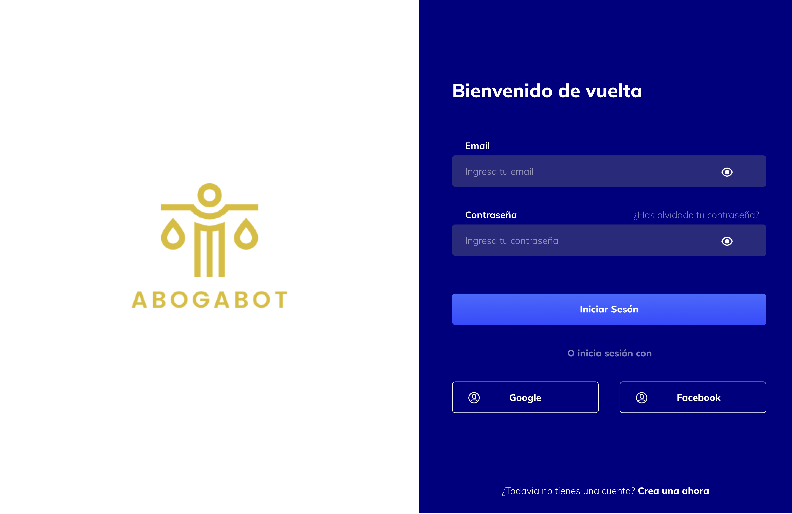
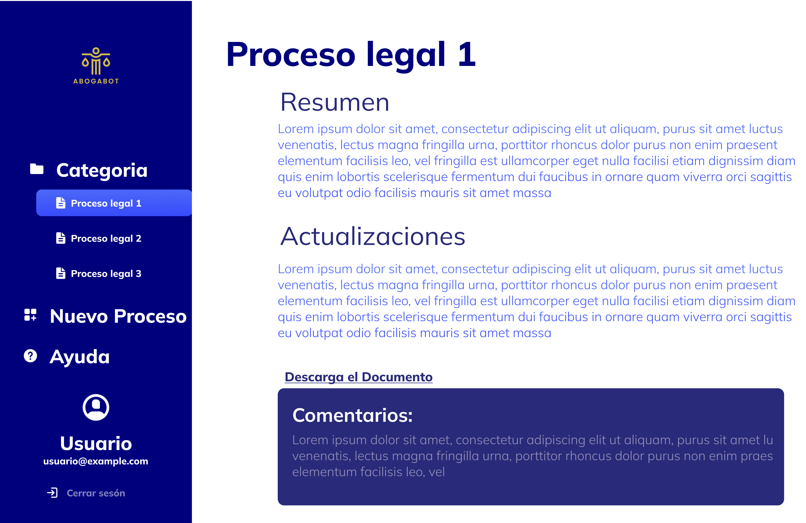

# Prácticas I

Intro FrontEnd

## Caso de Abogabot

1. Toma de requerimientos en [word](./Reqierimientos.doc) en [pdf](./Reqierimientos.pdf)
2. Buyer persona
   
3. Publico Objetivo
   En el siguiente link -> [https://miro.com/app/board/uXjVOJoAglA=/?invite_link_id=686055389981](https://miro.com/app/board/uXjVOJoAglA=/?invite_link_id=686055389981)
4. UX
   En el siguiente link -> [https://miro.com/app/board/uXjVOJpqPNI=/?invite_link_id=993910411767](https://miro.com/app/board/uXjVOJpqPNI=/?invite_link_id=993910411767)
5. UI
    
    
    
    

